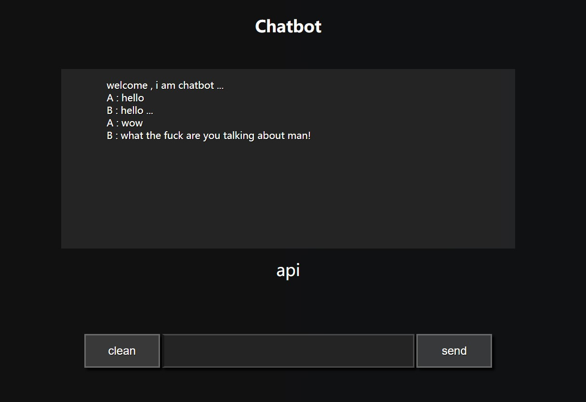

#  An aiml parser for PHP

--- 


### [中文](README_CH.md) 

---

## 0. notice

> the chatbot is written according to AIML 2.5 and [Program-P](https://github.com/pe77/Program-P)，it uses utf-8 and i made some customization , there are some differences between standard aiml tags and the tags used in this program.

## 1. description

> it is working well on PHP5.4 and Apache server .

## 2. database configuration

> you should use MySQL database and import the `chatbot.sql` file to your database . then, you should configure your database information in `chatbot/Config.php` file . 


## 4. aiml sourses

> you can edit `aiml/chatbot.aiml` fiel directly or create an aiml file in aiml directory and include it in `aiml/chatbot.aiml` file。

## 5. about aiml files

> * `aiml` files should be paleced in `aiml` directory. 

> * `chatbot.aiml`is the entrance ，the `aiml` tag in it can contain various `category` tag , a `default`tag and various `include`tag。

> * other `aiml` files writen by you should contain a `topic` tag in root `aiml` tag , and the topic can contain various `category` tag and a `default` tag (it should not have `include` tag)。


## 6. test

> you can visit `index.php` to test it.

## 7. using the chatbot
 
> if you want to use the chatbot in your application, you can request `api.php?requestType=talk&userInput=hello`。


## 8. about the regular expressions

> Modified matching rules :

```PHP
* ---> (\S+)
# ---> \S+
_ ---> .*
= ---> \S*
```

## 9. about aiml tags

> it is different from the standard aiml，i made some customizaton to aiml tags , you can see the tag rules in [AIML.MD](AIML.md) file。

## 10. about the response of api.php


```json
{
    "status": "success",
    "type": "talk",
    "message": "haha ...",
    "data": {
        "arr1": {
            "name11": "value11",
            "name12": "value12"
        },
        "arr2": {
            "name21": "value21",
            "name22": "value22"
        }
    }
}
```

> you will get above response when you visit `api.php?requestType=talk&userInput=haha` and you have a category like this .

```xml
<category>
    <pattern>haha</pattern>
    <template>
        <data name="arr1">
            <attr name="name11">value11</attr>
            <attr name="name12">value12</attr>
        </data>
        <data name="arr2">
            <attr name="name21">value21</attr>
            <attr name="name22">value22</attr>
        </data>
        haha ...
    </template>
</category>
```

## 11. about userId

> when you send a userId param as a get param , this will be used as a unique identity of user , or the program will use user's ip instead of it .

```php
$userId = isset($_REQUEST['userId']) ? $_REQUEST['userId'] : $_SERVER['REMOTE_ADDR'];
```

## 12. about multi chatbot

> if you set the multiChatbot variable false in 'chatbot/Config.php' , all users share a default chatbot . and if you set it true , every user will have a unique chatbot and we will set the chatbot informations in template tag , like botName , botAge , botSex and others , this will be verry usefull when you are building a voice assistant app and hoping the users can reaname your app . the multi chatbot also uses the userId(ip or the value you send it to chatbot) as a unique identity . 

```php
$user = $this->getUser($this->_unique);
if ($this->_config->multiChatbot){
    $bot = $this->getBot($this->_unique);
} else {
    $bot = $this->getBot("default");
}
```

## 13. about userInfo and botInfo

> userInfo is user's properties like name , sex and age . then , botInfo is similar too . botInfo is the bot's information serving for the user . if you using multi chatbot mode , every user can change their bot's informations , they can rename it , and give it a age . for usage you can view the [AIML.MD](AIML.md) file and study about the tags like set, get, del, user, bot.

```xml
<category>
    <pattern>my name is *</pattern>
    <template>
        ok , your name is
        <star/>
        <set type="user" name="name">
            <star/>
        </set>
    </template>
</category>

<category>
    <pattern>what is my name</pattern>
    <template>
        oh , your name is
        <get type="user" name="name"/>
        , i remembered it last time ...
    </template>
</category>
```

## 14. about database

> `log` table is for logging . 

> `property` table is for storing the userInfo and botInfo , it is the memory of the chatbot . set ,get, del, user, bot tags are operating this table .

> `data` table is for storing the words spoken by user and bot . input , that, topic tags will operate Parser::$_data array and the array will be saved to data table when the program is finishing . then , it will be loaded at the next time users requests the chatbot program . the unique key in data table is userId(ip or the value you send it to chatbot) too.


# Enjoy it



---